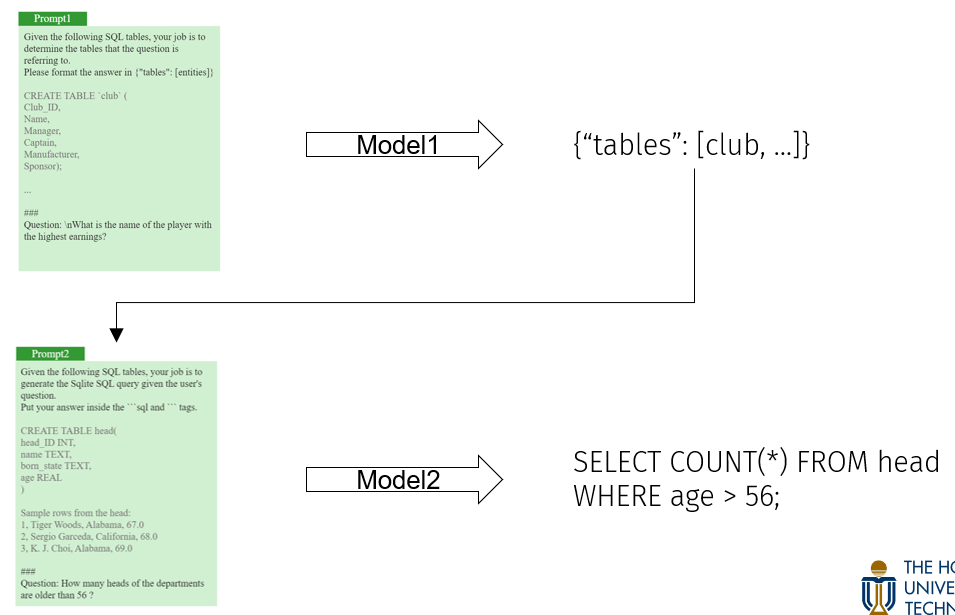
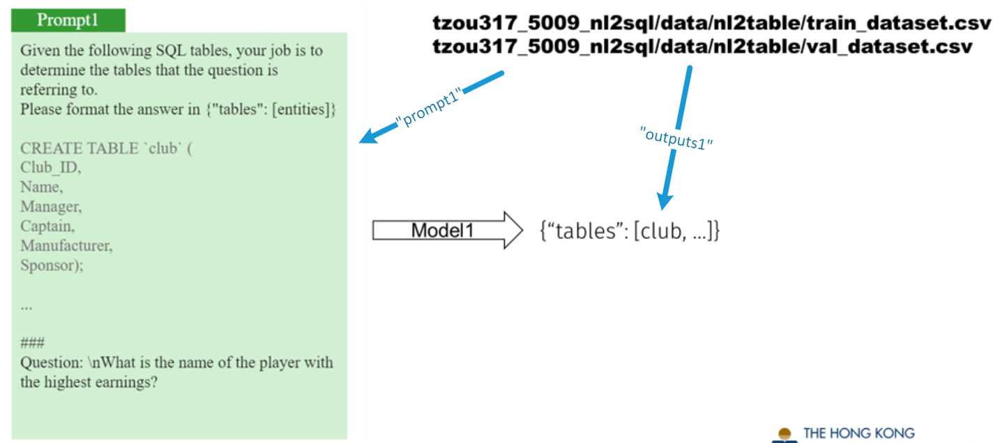
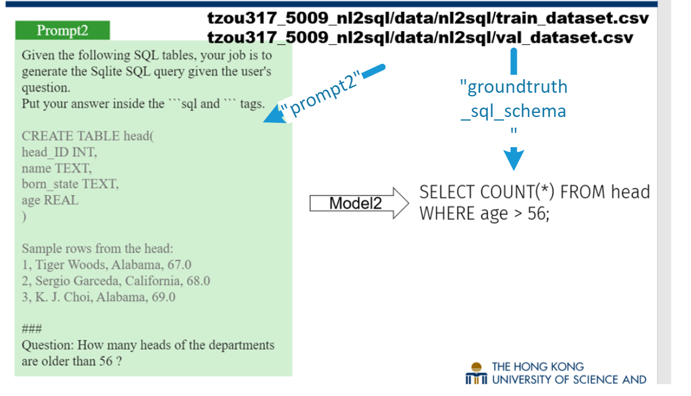

# 5009_nl2sql

# **Welconme, my dear WALL-E z.**


# 数据流图


## 第一阶段：


训练数据集：'共享数据区/tzou317_5009_nl2sql/data/nl2table/train_dataset.csv'

验证数据集：'共享数据区/tzou317_5009_nl2sql/data/nl2table/val_dataset.csv'

## 第二阶段


训练数据集：'共享数据区/tzou317_5009_nl2sql/data/nl2sql/train_dataset.csv'

验证数据集：'共享数据区/tzou317_5009_nl2sql/data/nl2sql/val_dataset.csv'

# Finetuning
## 第一阶段：nl2table finetuning
打开[nl2table_finetuning.py](nl2table_finetuning.py)，修改下面代码的文件路径后即可在HPC上开始训练。

```{python eval=FALSE, include=TRUE}
model_name = "deepseek-ai/deepseek-coder-6.7b-instruct"  # huggingface上模型的名称
model_dir = "..."  # 原始模型所存放的文件夹， 例如 ‘nl2sql/hf_models/deepseek’
dataset = load_dataset('csv', data_files={
    'train': '...',  # 训练数据路径， 例如'nl2sql/data/nl2table/train_dataset.csv'
    'validation': '...'  # 验证数据路径， 例如'nl2sql/data/nl2table/val_dataset.csv'
})
peft_output_dir = "..."  # PEFT层的输出路径，例如'nl2sql/peft_models/nl2table/peft_model'
```

## 第二阶段：nl2sql finetuning
```{python eval=FALSE, include=TRUE}
model_name = "deepseek-ai/deepseek-coder-6.7b-instruct"
model_dir = "..."  # 原始模型所存放的文件夹， 例如 ‘./hf_models/deepseek’
dataset = load_dataset('csv', data_files={
    'train': '...',  # 训练数据路径， 例如'./data/nl2sql/train_dataset.csv'
    'validation': '...'  # 验证数据路径， 例如'./data/nl2sql/val_dataset.csv'
})
peft_output_dir = "..."  # PEFT层的输出路径，例如'./peft_models/nl2sql/peft_model'
```


# Inference
测试集的prompt1是准备好了放在`tzou317_5009_nl2sql/data/nl2table/prompt1_test.json`中的。

## 第一阶段：nl2table inference
打开[nl2table_inference.py](nl2table_inference.py)，修改下面代码的文件路径后即可在HPC上开始推理。

```{python eval=FALSE, include=TRUE}
model_name = 'deepseek-ai/deepseek-coder-6.7b-instruct'
model_path = '...'  # 原始模型所存放的文件夹， 例如 ‘./hf_models/deepseek’
peft_layer_path = '...'  # 在finetuning中， PEFT层的输出路径，例如'./peft_models/nl2table/peft_model1'
test_data_prompt1 = '...'  # 测试集prompt1的路径，例如'./data/nl2table/prompt1_test.json'
test_data_output1 = '...'  # 测试集output1路径， 例如'./data/nl2table/outputs1_test.json'
```

## 第二阶段：nl2sql inference
打开[nl2sql_inference.py](nl2sql_inference.py)，修改下面代码的文件路径后即可在HPC上开始推理。

```{python eval=FALSE, include=TRUE}
model_name = 'deepseek-ai/deepseek-coder-6.7b-instruct'  # 模型名称
model_path = 'nl2sql/models/deepseek'  # 模型路径
peft_layer_path = 'nl2sql/experiment8/peft_model'  # nl2sql_finetuning.py文件中peft_output_dir所保存的PEFT层路径
spider_database_path = '/hpc2hdd/home/tzou317/nl2sql2/spider/test_database'  # Spider测试数据集的数据库文件夹，例如'./spider/test_database'
spider_test_json_path = '/hpc2hdd/home/tzou317/nl2sql2/spider/test_data/dev.json'  # Spider的测试数据集的.json路径， 例如'./spider/test_data/dev.json'
test_data_output1 = '/hpc2hdd/home/tzou317/nl2sql2/outputs1.json'  # 阶段1 输出的outputs1的路径，例如'./outputs1_test.json'
test_data_output2 = 'pred_test.sql'  # 一个存储预测出的最终.sql文件的路径，例如'./pred_test.sql'
```
